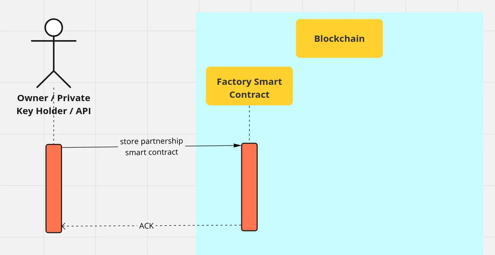

# Initialization

During initialization the raw WebAssembly data for the [BSC](../actors/bank-smart-contract.md) needs to be stored in the [FSC](../actors/factory-smart-contract.md). Before initialization all BSC deployments will fail.

<figure><figcaption>
RTP - Smart Contract initialization
</figcaption></figure>

