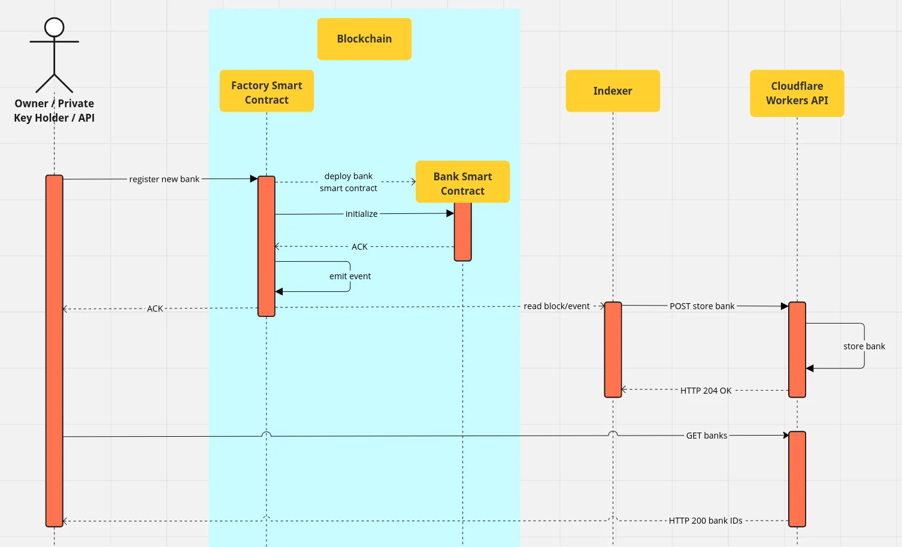

# New Bank

For a new Bank to be registered in the system following steps need to be executed:

1. Owner sends transaction to [FSC](../actors/factory-smart-contract.md) on blockchain to deploy new [BSC](../actors/bank-smart-contract.md).
2. FSC checks, if BSC is already deployed. If not, deploy it and call initialization function of BSC.
3. Once this transaction is confirmed, an [event](../terminology.md#events) will be emitted, that a new BSC has been deployed.
4. Indexer downloads the [block](../terminology.md#block) including this event and notifies [CW API](../actors/cloudflare-workers-api.md).
5. CW API stores bank internally.

<figure><figcaption>
RTP - new bank
</figcaption></figure>
