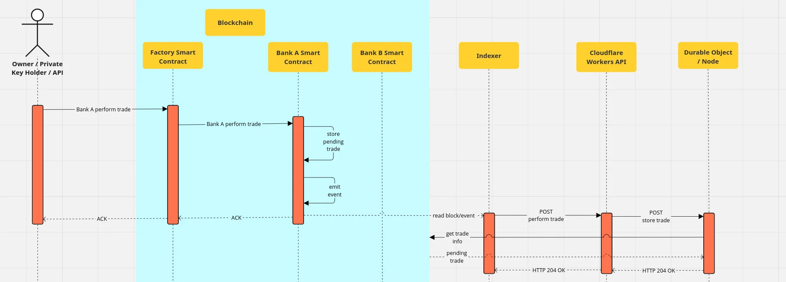
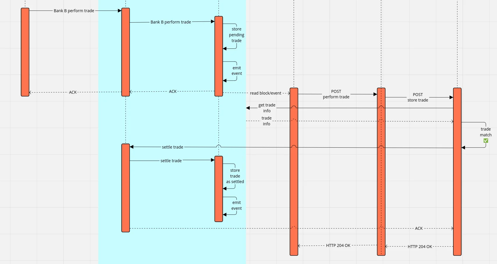

# Performing a Trade

To perform a trade between two Banks A & B, it is assumed that the respective [BSCs](../actors/bank-smart-contract.md) are already deployed. Afterwards both Bank A & B perform a trade between each other. Starting with Bank A following steps are performed:

1. Owner sends transaction to [FSC](../actors/factory-smart-contract.md) on blockchain to perform trade for Bank A.
2. FSC sends transaction to BSC for Bank A to perform trade.
3. BSC stores trade as pending and emits [event](../terminology.md#events).
4. Indexer downloads the [block](../terminology.md#block) including this event and notifies [CW API](../actors/cloudflare-workers-api.md).
5. CW API checks, if counterparty trade exists on the BSC for Bank B. No trade exists, so nothing happens.

<figure><figcaption>
RTP - perform trade Bank A
</figcaption></figure>

Afterwards Bank B also sends a trade to RTP:

1. Owner sends transaction to [FSC](../actors/factory-smart-contract.md) on blockchain to perform trade for Bank B.
2. FSC sends transaction to BSC for Bank B to perform trade.
3. BSC stores trade as pending and emits [event](../terminology.md#events).
4. Indexer downloads the [block](../terminology.md#block) including this event and notifies [CW API](../actors/cloudflare-workers-api.md).
5. CW API checks, if counterparty trade exists on the BSC for Bank A. Trade exists.
6. Check if trade data of Bank B matches the counterparty trade of Bank A.
7. Send transaction to FSC to settle trade between Bank A & B.
8. FSC sends transactions to respective BSCs of Bank A & B to settle trade.

<figure><figcaption>
RTP - perform trade Bank B
</figcaption></figure>
